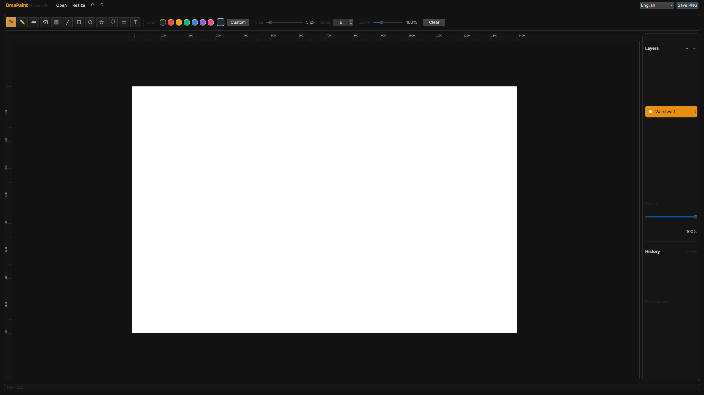

# OmaPaint

OmaPaint is a lightweight Paint-style drawing app built with Quickshell and QML, designed to fit naturally into an Omarchy desktop.

## Preview



## Run

```bash
./run-omapaint.sh
```

You can also install `org.omarchy.OmaPaint.desktop` into `~/.local/share/applications/`.

## Features

- Pen, pencil, marker, eraser, bucket fill, shapes, star, polygon and text tools
- Text boxes with wrapping and resize handles
- Movable and resizable image objects opened from PNG/JPEG/WebP files
- Layers with visibility and opacity controls
- Simple mode by default, with an optional Layers panel toggle for advanced workflows
- Selection, move, resize, cut, copy and paste
- Undo/redo history
- PNG export
- Canvas resizing and zooming with pointer-centered mouse-wheel zoom
- Rulers and an Omarchy theme-aware dark interface
- Polish, English and automatic system-locale interface modes

## Requirements

- Linux with Quickshell and QtQuick Controls
- An Omarchy desktop is recommended, but the app only requires a working Quickshell installation

## Packages

Packaging files for version `0.5.1` are included in `packaging/`:

- Debian/Ubuntu: build from the repository root with `dpkg-buildpackage -us -uc`
- Arch/Omarchy: build with `makepkg -si packaging/arch/PKGBUILD`

Both packages require Quickshell to be installed on the target system.

## License

This project is currently shared as-is. Add a license before redistributing it as a packaged application.
